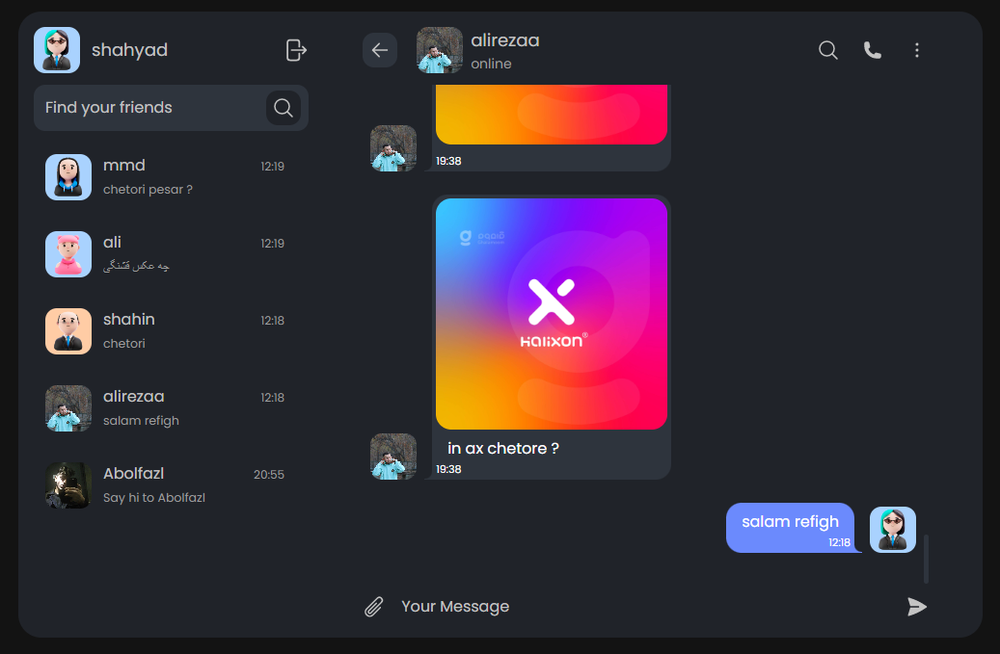
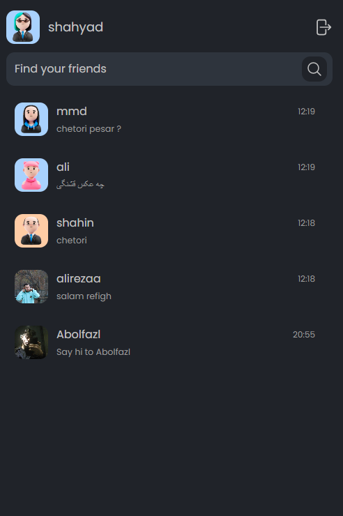
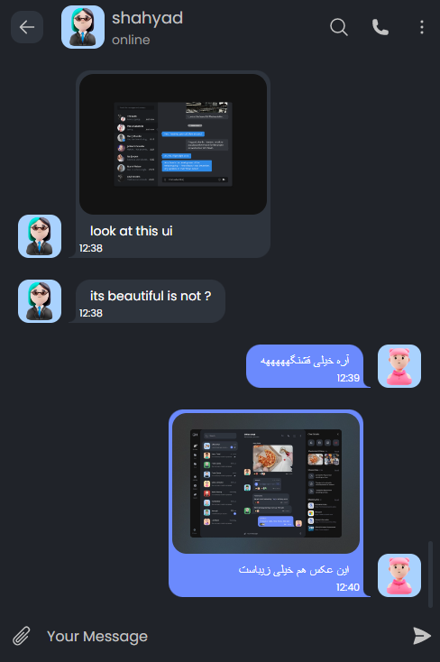

 
Messenger on desktop

 
Messenger on mobile

 
Messenger on mobile

Hey guys, this is a messenger web app where you can chat to your friends and share your photos,
In this app, I used React Firebase and Tailwind CSS.

The purpose of this app is to practice and understand more about working with the database and the data sent by the API & back-end.
